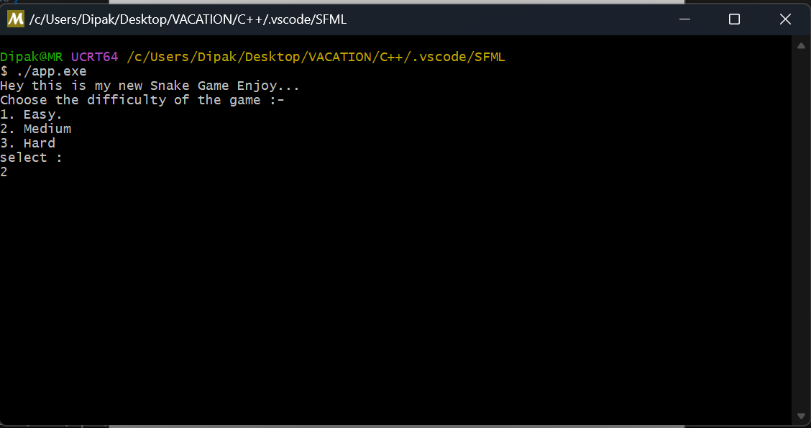
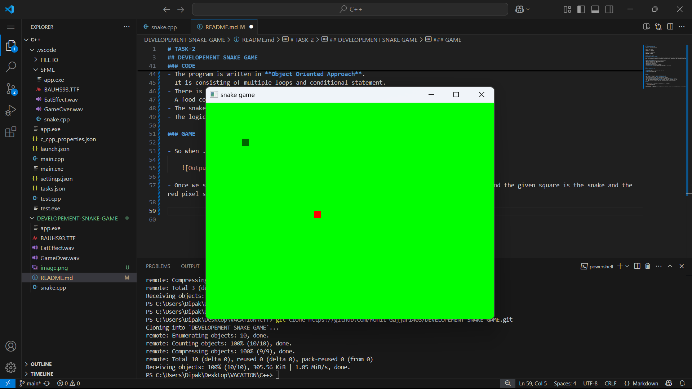
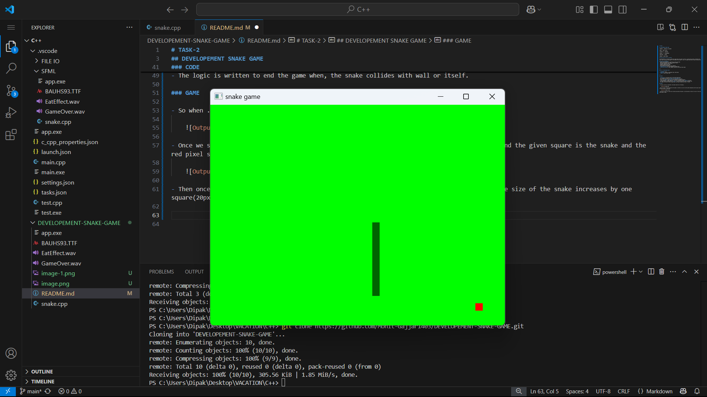
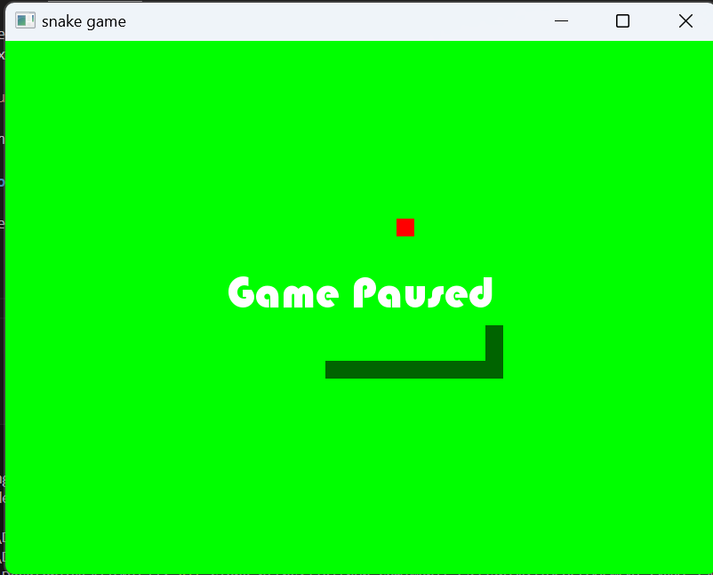
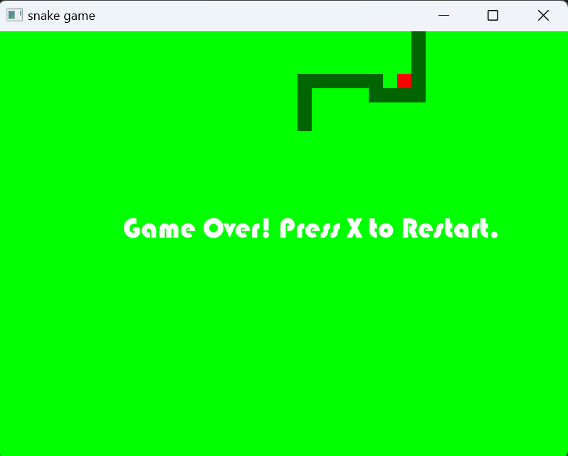

# TASK-2

## DEVELOPEMENT SNAKE GAME

*COMPANY* : CODETECH IT SOLUTION

*NAME* : MOHIT GAJJAR

*INTERN ID* : CT04DF386

*DOMAIN* : C++ PROGRAMMING

*DURATION* : 4 WEEKS

*MENTOR* : NEELA SANTOS

### Snake Game using C++ and SFML

The Snake Game is a timeless arcade-style game where the player controls a snake moving around a bordered area. The goal is to eat food, which increases the length of the snake and the player's score. The game ends when the snake collides with itself or the wall.

### Features Implemented:
- Smooth snake movement in 4 directions using arrow keys
- Real-time rendering using SFML's graphics module
- Collision detection (wall & self)
- Randomly spawning food logic
- Score tracking and display
- Pause/Resume functionality with a keypress
- **Sound effects** for food consumption and game over
- **Difficulty levels**: Easy, Medium, and Hard (affecting snake speed)

---

### 🧑‍💻 Technologies Used

- **Language**: C++
- **Library**: [SFML 2.6.x]{Graphics.hpp, Audio.hpp}
- **IDE**: Visual Studio Code

---

### CODE 

- **snake.cpp** is the code file for the entire game code.
- The program is written in **Object Oriented Approach**.
- It is consisting of multiple loops and conditional statement.
- There is a **body** and **head** of the snake as different component.
- A food component is made seperately, the food is generated using **rand()** function.
- The snake speed is handled by the **delay**, thus the difficulty alters the delay time.
- The logic is written to end the game when, the snake collides with wall or itself.

### GAME

- So when .exe file is executed, the output would be as following :

    

- Once we select the game difficulty the game is started as you can see the green background and the given square is the snake and the red pixel square is the apple.

    

- Then once we start the snake start moving and eating the apple, by intersecting its head. The size of the snake increases by one square(20px X 20px).

    

- Then we have to keep eating the apples and not hit the grid and the body itself. The snake body is a vector of RectangularShape class objects.

### Additional Features

- The voice are added like eat chomp and game over sound.

- The Game can be paused when the **Esc**, and a "Game Paused" is displayed.

    

- When the snake hits the grid or itself, the Game Over sound is generated and the "Game Over Text is displayed. You can restart the game by presssing X.

    
 
This are the extra feature that are added to the gamee.